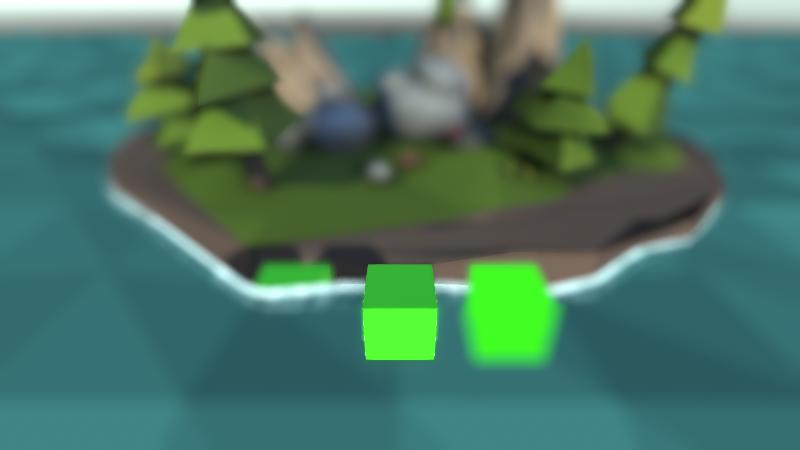

# 水とUnlitシェーダーとDepth of Field




[](https://twitter.com/intent/tweet?text=Wow:&url=https%3A%2F%2Fgithub.com%2Fam1tanaka%2FWaterUnlitDOF)

ポストプロセスの被写界深度効果(Depth of Field)を使うと、水面のような半透明ものや影がないUnlitシェーダーが正常に描かれないことがあります。これは動作確認用のリポジトリーです。

原因や解決策は以下のブログに書きました。

[水面やUnlitシェーダーとDepth of Fieldの不具合対策メモ](https://am1tanaka.hatenablog.com/entry/water-unlit-dof)

## 動作環境
- Unity2020.3.9f1
- PostProcessing Stack Ver3.1.1
- LowPoly Water Ver1.0.0


## プロジェクトの準備
プロジェクトを動かす手順です。

1. このプロジェクトを任意の場所にダウンロードして展開したり、クローンしてください
1. Unityで開きます。本プロジェクトはUnity2020.3.9f1で作成しました
1. Package Managerから [Ebru Dogan. LowPoly Water](https://assetstore.unity.com/packages/tools/particles-effects/lowpoly-water-107563) をインポートします。折角なので好評価も是非
1. Projectウィンドウから Assets > WaterUnlitDOF > Scenesフォルダーを開きます
1. 以下のようなシーンを用意してあります。好きなものをダブルクリックで開いてください
  - DemoSceneEx
    - 問題が発生しているシーンです
  - DemoSceneFix00Fade
    - StandardシェーダーのFadeで描画している左のCubeの不具合を対策したシーンです。下が白くなっているのは水面の不具合です
  - DemoSceneFix01Unlit
    - 左のCubeに加えて、Unlitシェーダーで描画している右のCubeの不具合を対策したシーンです。透け方が不自然なのは水面の不具合です
  - DemoSceneFix02Water
    - 上記に加えて、水面シェーダー以外の不具合を対策したシーンです。LowPoly Waterのシェーダーに手を加える必要があるので、以下に従ってWaterShadedシェーダーを修正すると対策が完了します

## WaterShadedシェーダーの修正
やることは以下の通りです。詳しくはブログを参照ください。

[水面やUnlitシェーダーとDepth of Fieldの不具合対策メモ](https://am1tanaka.hatenablog.com/entry/water-unlit-dof)

- ProjetウィンドウのAssets > LowPolyWater_Pack > Shaders フォルダーを開いて、WaterShadedシェーダーをダブルクリックして開きます
- 26行目付近の`_CameraDepthTexture`を`_WaterDepthTex`に書き換えます
- 159行目の`half depth=`から始まる行にある`_CameraDepthTexture`を`_WaterDepthTex`に書き換えます

```cs
// 159:
			half depth = SAMPLE_DEPTH_TEXTURE_PROJ(_WaterDepthTex, UNITY_PROJ_COORD(i.screenPos));
```

これでMain CameraのZバッファではなく、こちらで作成した **_WaterDepthTex** から奥行きを取り出すようになります。カメラのaspectを正しく設定しておけば、正方形のRenderTextureからちゃんとアスペクト比に従って参照してくれます。

次にRender Queueを変更します。

- 183行目付近の`Tags`を以下のように修正します

```cs
// 183:
	Tags {"RenderType"="Transparent" "Queue"="AlphaTest-1"}
```

水面描画時のZWriteをOnにします。

```cs
// 193:
			ZWrite On
```

207行目の`}`の後ろで改行して、以下のShadowCasterのパスを追加します。

```cs
// 208:

	Pass{
			Tags { "LightMode" = "ShadowCaster"}
			ZWrite On
			ColorMask 0
	}
```

以上で完了です。水面がくっきり表示されるようになります。

## 使用アセット
- [Ebru Dogan. LowPoly Water](https://assetstore.unity.com/packages/tools/particles-effects/lowpoly-water-107563)
- PostProcessing Stack
- https://shields.io/

## 関連ブログ
- [水面やUnlitシェーダーとDepth of Fieldの不具合対策メモ](https://am1tanaka.hatenablog.com/entry/water-unlit-dof)

## ライセンス
[The MIT License](./LICENSE.md)

Copyright (C) 2022 Yu Tanaka
